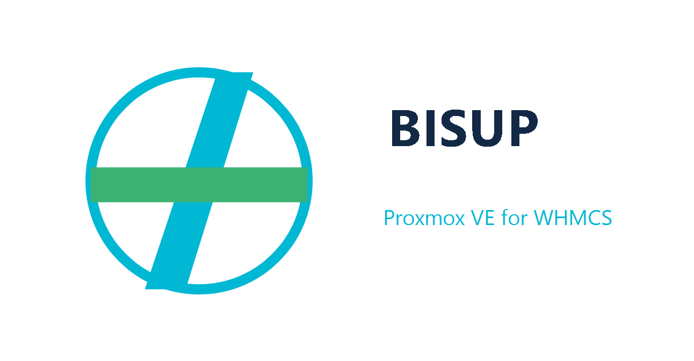

# Proxmox VE for WHMCS (Module) Provision & Manage

**Salvation, a free and open-source solution for beloved PVE!** If you love it, REVIEW & SHARE IT! Cheers. ❤️

    TNC Dev are looking for a co-developer to assist with finishing the project overhaul.
    If you have proven and public git-logged experience, or similar, please say g'day.
    
    Please note: We are only looking for high-quality applicants with spare time.
    As it stands, we won't have much spare dev time for this Module in 2026.

- Configure VM/CT plans with custom CPU/RAM/VLAN/On-boot/Bandwidth/etc
- Automatically Provision VMs & CTs in **Proxmox VE** from **WHMCS** easily
- Allow clients to view/manage VMs using the WHMCS Client Area
- Create/Suspend/Unsuspend/Terminate via WHMCS Admin Area
- Statistics/Graphing is available in the Client Area for services :)
- Leverage the power of QEMU & LXC with PVE's convenience
- Import existing VM/CT Guest from Proxmox into WHMCS
- Choose PVE VMID start & integrate to your schema
- 128GB+ RAM & 128+ CPU cores per Guest!

https://github.com/The-Network-Crew/Proxmox-VE-for-WHMCS/

**Client Area GUI - w/ Stats:**

> [!IMPORTANT]  
> Nodes must be using RRD `PVE-$TYPE-9.0` format. You can use `proxmox-rrd-migration-tool` to migrate.
> 
> Old RRD Dir for VMs: `/var/lib/rrdcached/db/pve2-vm/`  
> New RRD Dir for VMs: `/var/lib/rrdcached/db/pve-vm-9.0/`
> 
> You can research more online, and <a href="https://www.mail-archive.com/pve-devel@lists.proxmox.com/msg29223.html" target="_blank">here is part of a patch series</a> showing the new logic.

**Admin Area GUI - PVE Nodes:**

**Admin Area GUI - Guests:**

# ❤️ RTFM: Read the Manual & Review the Module!

**Please read the entire README.md file before getting started with Proxmox VE for WHMCS (`pvewhmcs`).**

> **Please review the module!** https://marketplace.whmcs.com/product/6935-proxmox-ve-for-whmcs#reviews
> 
> _If you want it to remain free and fabulous, it could use a moment of your time in reviewing it._ **Thanks!**

# 🎯 MODULE: System Requirements (PVE/WHMCS)

- **(WHMCS)** v8.x.x stable (HTTPS)
- **(NET)** WAN Access: WHMCS to PVE
- **(VNC)** Special Requirements: PTR, etc.
- **(PHP)** v8.x.x (latest stable version)
- **(PHP)** max_execution_time = 300
- **(Proxmox)** 2 users (API & VNC)
- **(Proxmox)** VE v8.4/v9 (latest)

Please note specific VNC & Network requirements below - read 100% of the README.md. :-)

# ✅ MODULE: Installation & Configuration

> [!WARNING]
> **DON'T SKIP ANY PART OF THIS README.md & please don't raise pointless Issues - thank you!**

## 📋 1. PREP: Upload & Configure the Module

**First, read the above System Requirements, and resolve any blockers to using Proxmox VE for WHMCS.**

### 👥 PVE: User x2 Requirement (API & VNC users)

#### Credentials: root account for each PVE host

**You must have a root account to use the Module at all.** Configured via WHMCS > Servers.

This is configured in the `pam` realm. 

#### Credentials: VNC user for Console Access only

Additionally, to improve security, for VNC you must also have a Restricted User. 

Configured in the _Module_ as detailed below, once you've added/restricted it in PVE.

### 🏃‍♂️ Installing the WHMCS Module `pvewhmcs`

**First up, get the basics sorted out:**

0. Upload the Module to your WHMCS installation, ensuring correct permissions/ownership.
1. Activate it via WHMCS > Addon Modules > Proxmox VE for WHMCS > Activate.
2. In the same spot post-activation, expose the Module to Administrators.
3. Make sure your Proxmox host has a valid SSL Certificate installed.
4. Ensure you've TCP/8006 connectivity between WHMCS & PVE.

**Once you've done all of that, in order to get the module working properly, you need to:**

0. Proxmox VE > Create an additional VNC-only user, per instructions below
1. WHMCS Admin > Config > Servers > Add (Advanced) > PVE Host/s (User: `root`; IPv4: `PVE's`; no port suffix!)
2. WHMCS Admin > Addons > Proxmox VE for WHMCS > Module Config > VNC Secret (see below)
3. WHMCS Admin > Addons > Proxmox VE for WHMCS > Add QEMU/LXC Plan/s
4. WHMCS Admin > Addons > Proxmox VE for WHMCS > Add an IPv4 Pool
5. WHMCS Admin > Config > Products/Services > New Service (create offering)
6. " " > Newly-added Service > Tab 3 > **SAVE** (links Module Plan to WHMCS Service type)
7. (Optional) WHMCS Admin > Addons > Proxmox VE for WHMCS > Import Guest

#### Admin GUI: QEMU Plan :: Creation interface

#### Admin GUI: WHMCS Product/Service "Module" SAVE!

#### Admin GUI: WHMCS Servers > Links direct to PVE GUI

 Configuration > Servers interface, showing link button to Proxmox GUI, labelled with the PVE hostname" src="_images/zServerListLink.png">

## 🥽 2. noVNC: Console Tunnel (Client Area)

After forking the module, we considered how to improve security of Console Tunneling via WHMCS. We decided to implement a routing method which uses a secondary user in Proxmox VE with very restrictive permissions. 

**This is due to be re-built again in 2026 to further enhance security.**

### How to offer VNC via WHMCS Client Area!

1. Install & configure the module properly
2. Follow the PVE User Requirement info below
3. Routed IPv4 for PVE (or TLS-proxy to LAN)
4. PVE and WHMCS on the same 1x Domain Name*
5. Have valid PTR/rDNS set on the PVE Address

> **If proxying, that is your sole responsibility to configure & diagnose.**
> 
> Otherwise, PVE must be WAN-accessible and all other configs/reqs satisfied.

### Creating the VNC User within Proxmox VE

1. Create User Group "VNC" via PVE > ` Datacenter / Permissions / Group`
2. Create new User "vnc" > `Datacenter / Permissions / Users` - Group: "VNC", Realm: pve
3. Create new Role -> `Datacenter / Permissions / Roles` - Name: "VNC", Privileges: VM.Console (only)
4. Permit VNC Access -> `Datacenter / Permissions / Add Group Permissions` - Group: "VNC", Role: "VNC"
5. WHMCS > Modules > Proxmox VE for WHMCS > Module Config > VNC Secret = 'vnc' password (PVE) you set

> [!CAUTION]
> Do NOT set less restrictive permissions. The above is designed for interim security.
> 
> **However, if you wish for proper security: wait for VNC to be further improved.**

### Important info about Console Access

**noVNC has been overhauled. It isn't guaranteed, nor the project at all. :-)**

Once you have it configured, clicking noVNC in Client Area provides direct link - click it:

**Here are most of the critical requirements for VNC tunnelling:**

1. PVE must be at an IPv4 which has PTR the exact same as PVE's hostname.
2. You must use different Subdomains on the 1x Domain Name, for the cookie (anti-CSRF).
3. If your Domain Name has a 2-part TLD (ie. co.uk) then you will need to fork & amend `novnc_router.php` - ideally we/someone will optimise this down the track.
4. You must configure a VNC Secret in the Module Settings, after creating it in PVE.
5. You must have a stable and "relatively" static IPv4 fixed/routed WAN address for each PVE host. **CGNAT, Cellular & other "fast DHCP" style configurations cannot be worked with due to a variety of external network issues.** We will not support anything except a perfectly-configured `pvewhmcs`. Thank you!
6. Cookies must be properly usable and not manipulated by htaccess or similar rules, to ensure that `PVEAuthCookie` is properly set in-browser, for same-domain cross-subdomain access.

> [!TIP]
> **To troubleshoot noVNC errors like "Connection Closed (1006)":**
> 
> Load noVNC with `logging=debug` added to the query string, ie. `vnc.html?logging=debug` 
> _Or in Settings change Logging to debug-level, then open JS Console before reloading noVNC._
> 
> Typically, 401 No Ticket from PVE (1006 Connection Closed via noVNC) is due to cross-domain attempts being made, ie. WHMCS on domain1.com and PVE on domain2.com. You must use subdomains on the same Domain, with PTR, etc - else it won't work. **Please take the time to read this documentation.**

## 🌐 3. Networking: IPv4 Pools, IPv6, vmbr/SDN

### IPv4: Pool required for assignment

Please make sure you create an IPv4 Pool with sufficient scope/size to be able to deploy addresses within it to your guest VMs and CTs. Else it won't be able to create a Service for you.

#### Private IPs for PVE Hosts

Note that VNC may be problematic without work due to the strict requirements introduced in Proxmox v8.0 (strict same-site attribute). Just as SSL/TLS Certificates are no longer trusted for Public IP Addresses, there is increasing work to make the web secure-by-default which makes VNC/etc safer. 

#### Existing Guest Imports from PVE

Take note that during the Guest Import process, there is no association ensured to an IP Pool, rather we take your inputs and use them verbatim due to existing/current nature of the Guest's configuration.

### IPv6: SLAAC default (via 2nd vNIC)

Available options: 
1. **SLAAC** (2nd vNIC)
2. **DHCP** (2nd vNIC)
3. **Off** (v4-only)

You may add different config via PVE/`pvesh` manually of course, if you need to specify a prefix etc.

### vmbr / SDN: Config type

This depends on your configuration on the PVE Host/s - bridge (vmbr0 etc) or software-defined (SDN).

- **If normal (bridged)** - use `vmbr` as the Network, then use `0` as the Interface ID - this makes up `vmbr0`.
- **If SDN (Software Defined Network)** - use SDN Name for Network, leave Interface ID blank (= no suffix).

## ⚙️ 4. VM/CT PLANS: Setting everything up

These steps explain the unique requirements for QEMU & LXC guests.

**Custom Fields:** Values need to go in Name & Select Options. 
This needs configuring for each `WHMCS Admin > Products & Services` entry.

### VM Option 1: QEMU, PVE Template VM Clone

Firstly, create the Template VM in PVE. You need its unique PVE ID.

Secondly, use that ID in the Custom Field `KVMTemplate`, as in `ID|Name`.

> **Note**: `ID` is the Unique ID that your Template VM has in PVE. 
> **Note**: `Name` is what will be displayed to your Clients in WHMCS.

Thirdly, add another Custom Field `TPL_Node_QEMU` with the node short name.

### VM Option 2: QEMU, WHMCS Plan + PVE ISO

Firstly, create the Plan in WHMCS Module. Then too in WHMCS Config > Services.

> Under the Service, you need to add a Custom Field `ISO` with the full location. 
> This ISO must be located on all PVE Nodes, and not on the WHMCS installation side.

### CT Option 1: LXC, PVE Template File

Firstly, store the Template in PVE. You need its storage, folder & File Name.

Secondly, use that prefixed file name in the Custom Field `Template`.

> Here is the syntax for that field, including display name: 
> `local:vztmpl/ubuntu-99.99-standard_amd64.tar.gz|Ubuntu 99`

Thirdly, add another Custom Field `TPL_Node_LXC` with the node short name.

### VM/CT Import/Associate Existing Guest

You can associate an existing PVE Guest through the WHMCS Module too, like this:

> [!CAUTION]  
> All module-imported services need to be checked and amended to ensure configs such as Billing Cycle, Price, Discount, Assigned IPs, NS1/2, etc, are properly set!

### Custom Fields: Important Notes (ZFS/CTs)

#### ZFS etc: Configure to suit isolated TPLs

- `local` is the name of the file-system that you have the Template on
- `vztmpl` is the directoty name per convention, with the ISO within
- `ubuntu-99.99-...` etc is the Template file name, exactly as-is

If using ZFS for Templates, substitute `local` with the volume name.

#### Password: Configure the CT's root user

Create a 2nd Custom Field `Password` for the Container's root user on all CT Services.

## 🔄 5. PATCH: Updating the Module

### Regularly check for updates

**WHMCS Admin -> Addon Modules -> Proxmox VE for WHMCS -> Support/Health**

### Updating to a newer release!

> [!WARNING]  
> There are 2x states that new Proxmox VE for WHMCS releases typically go through.
> 
> 1. Module shows Update Available, but GitHub repo does NOT have a published release. 
>    In this state, it is ready for testing - but we do not recommend deploying to prod.
> 2. Module shows Update Available, and GitHub repo DOES have a published release. 
>    In this state, it is tested and considered ready for production usage.

1. Download the new version
2. Upload it over the top (FTP)
3. Login to WHMCS Admin
4. Verify all working OK
5. **Watch the repo!**

> **Logging in _should_ trigger the self-upgrade procedure for the SQL database.**
> 
> (**Beta Feature:** For now, verify yourself that updates were successful)

### SQL: Keeping your DB up-to-date

> [!IMPORTANT]  
> Since v1.3.x, logging into WHMCS Admin & opening the module should run any needed SQL Ops.
> 
> v1.2.x & below, consult the **_docs/UPDATE-SQL.md** file, open your SQL DB & run statements. 

Then you're done with each update!

_**Note**: db.sql file currently contains new tables for v1.3.x releases as well_

## 🆘 6. HELP: Best-effort Support

> [!WARNING]  
> We will not support ANY set-ups which do not follow ALL of the set-up processes 100%.
> 
> Read the ENTIRE README, understand it, follow it, and submit detailed Issues.
> 
> Else, do not expect any form of Support. Respect our time. Thank you!

### Before raising a GitHub Issue, please check:

1. The Wiki.
2. The README.md.
3. Open GitHub Issues on the repo.
4. HTTP, PHP, WHMCS & debug logs (see below).
5. PVE logs; best practices; network; etc.
6. Read the errors. Do they explain it?

### Issues/etc raised must include:

**Logs:** We work to ensure that Proxmox VE for WHMCS passes through error details to you.

Hence, we ask that you are as verbose and thorough as possible when reporting Issues. Thanks!

#### All Logs & Debug Logging too

- **(Logs: PHP)** `error_log` contents
- **(Logs: WHMCS)** Module Debug Logging*
- **(Logs: Config)** WHMCS Display/Log Errors = ON
- **(Logs: PVE)** Logs from Proxmox Host/s (`pveproxy` etc)

#### Other Requirements for Support

- **(Visibility)** Screenshots of the issue
- **(Configs)** WHMCS/PHP/Module/Proxmox/etc
- **(Reproduction)** `pvesh` etc variants of failing calls
- **(Network)** Proof WHMCS Server can talk to PVE OK
- **(PEBKAC)** _PROOF THAT YOU'VE FOLLOWED THIS README!_

**The more info & context you provide up-front, the quicker & easier it will be!**

\* Debug: Also enable Debug Logging in Proxmox VE for WHMCS > Settings, as needed.

> [!TIP]
> **Please note that this is FOSS and Support is not guaranteed at all.** 
> 
> **If you don't read, listen or actively try, no help will be provided.**
> 
> https://github.com/The-Network-Crew/Proxmox-VE-for-WHMCS/issues/new/choose

# 💅 FEATURES: Upcoming PVE bling

There are new features deployed into PVE upstream which are exciting and may be integrated.

**PVE Roadmap:** https://pve.proxmox.com/wiki/Roadmap

### Proxmox v9.x

1. VM snapshots on thick LVM, snapshots as volume chains
2. Fabrics for software networking (SDN) Open/OSPF/Ceph/VPN
3. Major upgrade to Debian Trixie (testing status in 2025)

### Proxmox v8.x

1. Live migrate with mediated devices
2. Support for external Backup providers
3. Host dir's, share with guests (virtiofs)
4. Firewall into Software-defined Networking
5. Webhook target for system alerting
6. Better change detection for PBS
7. (✅) Import Wizard for VMware/etc Guests
8. Unattended PVE Install (via answer file)
9. Backup Fleecing (local disk as data block buffer)
10. Secure Boot support
11. (✅) Software Defined Networking (SDN)
12. New flexible notification system (SMTP & Gotify)
13. MAC Organizationally Unique Identifier (OUI) BC:24:11: prefix!
14. Create, manage & assign resource mappings for PCI & USB devices for use in VMs via API and GUI
15. (✅) Add CPUs (x86-64 psABI Micro-Architecture Levels) & adopt default x86-64-v2-AES

### Proxmox 7.x

1. Cross-cluster guest migrations
2. Cluster Resource Scheduling (CRS) launched
3. Re-balance CRS on fresh start-up, not just on-recovery
4. CRM into HA Manager, as a node maintenance switch 

# 🖥️ INC: Libraries & Dependencies

| License | Dependency | In-use Ver. | Link to Repository, etc.|
|---------|------------|-------------|-------------------------|
| **(MIT)** | PHP Client for PVE2 API | **2022/Dec/05** | https://github.com/CpuID/pve2-api-php-client |
| **(MPLv2)** | noVNC HTML5 Viewer | **v1.7.0** | https://github.com/novnc/noVNC/ |
| **(MIT)** | IPv4/SN Validation | **August 2012** | https://github.com/tapmodo/php-ipv4/ |

# 📄 DIY: Documentation & Resources

| Developer | Link to Documentation, etc. |
|-----------|-----------------------------|
| **(PVE)** | https://pve.proxmox.com/pve-docs/api-viewer/ |
| **(noVNC)** | https://github.com/novnc/noVNC/wiki |
| **(WHMCS)** | https://developers.whmcs.com & https://classdocs.whmcs.com |
| **(psABIs)** | https://gitlab.com/x86-psABIs/x86-64-ABI/-/jobs/artifacts/master/raw/x86-64-ABI/abi.pdf?job=build |

# 🤬 ABUSE: Zero Tolerance (ZT)

This module has been overhauled and remains functionally-OK but not thoroughly tested nor reviewed.

Your support and assistance is always welcomed per the spirit of FOSS (Free Open-source Software)!

If you cannot accept this, do not download nor use the code. Complaints, nasty reviews, and similar behaviour is against the spirit of FOSS and will not be tolerated. 

**Be grateful & considerate - thank you!**

# 🎉 FOSS: Open-source Contributions

If you'd like to contribute to the Module, please open a Pull on GitHub >> The-Network-Crew/Proxmox-VE-for-WHMCS >> cheers! _The original module was written in 2 months by @cybercoder for sale online in 2016, though didn't sell any copies so they kindly open-sourced it and removed the licensing requirement._

**Thank you to psyborg® for the module's logo design! We love it.**

FOSS is only possible thanks to dedicated people around the world! :-)

**See [CONTRIBUTORS.md](https://github.com/The-Network-Crew/Proxmox-VE-for-WHMCS/blob/master/CONTRIBUTORS.md) for those who've made PVEWHMCS possible.**

# TNC & Co.

**The Network Crew Pty Ltd** :: https://tnc.works

**🍷 Merlot Digital** :: https://merlot.digital

**AS138521** :: Australian family owned

# GPLv3

> [!NOTE]
> _**This module is licensed under the GNU General Public License (GPL) v3.0.**_
> 
> GPLv3: https://www.gnu.org/licenses/gpl-3.0.txt (by the Free Software Foundation)
